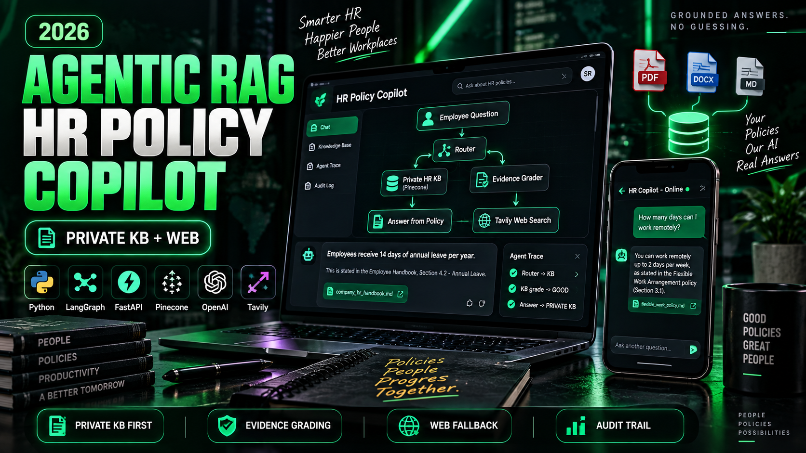

# Enterprise HR Policy & Employee Support Agentic RAG Copilot



An HR assistant that answers employee questions from private company documents first. It uses web search only when the private documents do not have enough evidence.

The project uses LangGraph, FastAPI, Pinecone, OpenAI, Tavily, and a plain HTML, CSS, and JavaScript user interface.

## Contents

1. [Business problem](#1-business-problem)
2. [Architecture](#2-architecture)
3. [Agentic RAG workflow](#3-agentic-rag-workflow)
4. [Technology stack](#4-technology-stack)
5. [Project structure](#5-project-structure)
6. [Setup, step by step](#6-setup-step-by-step)
7. [Run with Docker](#7-run-with-docker)
8. [Use the API](#8-use-the-api)
9. [Demo scenarios](#9-demo-scenarios)
10. [Troubleshooting](#10-troubleshooting)
11. [Credits](#11-credits)

## 1. Business problem

### Customer

NovaRetail is a fictional retail company with 3,000 employees.

### Problem

The HR team keeps many internal documents. These documents include:

- Leave policies and remote-work rules
- Payroll guidance and benefits information
- Onboarding procedures and conduct policies
- HR operations runbooks

Employees still send the same HR questions again and again. The causes are:

- Employees do not know where the correct policy is.
- Keyword search returns too many documents.
- Generic chatbots can invent policy details.
- Internal documents do not always cover current public regulations.
- Some questions need fresh external information.

### Example

An employee asks:

> "How many annual leave days do employees receive?"

The answer is in the private HR knowledge base (KB). The system must answer from internal policy and must not search the public internet.

Another employee asks:

> "What are the latest public holiday rules in Bangladesh?"

The internal KB possibly does not have current public information. The system must find that the private evidence is weak. Then it uses web search, grades the web evidence, and marks the answer as external information that HR must validate.

### Goals

The HR Policy Copilot must:

1. Search the trusted private HR knowledge first.
2. Check if the retrieved evidence is sufficient.
3. Use web search only when the private knowledge is not sufficient.
4. Rewrite weak queries and try again.
5. Give answers that are grounded in evidence.
6. Show the LangGraph decision path for transparency and debugging.
7. Let authorized HR staff add new company documents.

## 2. Architecture


```text
Employee / HR User
        |
HTML/CSS/JavaScript Web UI
        | POST /api/chat
FastAPI
        |
LangGraph Agentic RAG Controller
        |
 +---------------+-----------------+
 |                                 |
Private HR KB                Tavily Web Search
Pinecone                     (fallback only)
 +---------------+-----------------+
                 |
            OpenAI LLM
          Grounded Answer
```

## 3. Agentic RAG workflow

```text
Question
   |
[1] Route question
   +-- Greeting / simple chat ---------> Direct answer
   |
   +-- HR / policy question
                |
[2] Retrieve from private Pinecone KB
                |
[3] Grade private evidence
       +--------+--------+
       |                 |
     GOOD               WEAK
       |                 |
       v                 v
Generate from KB   [4] Tavily web search
                         |
                  [5] Grade web evidence
                    +----+-----+
                    |          |
                  GOOD        WEAK
                    |          |
                    v          v
            Generate from web  [6] Rewrite query
                               |
                         Retry private KB
                               |
                     Maximum retries reached?
                               |
                      Insufficient evidence
```

The graph is in `app/rag/workflow.py`. The shared state is in `app/rag/state.py`. The `MAX_RETRIES` setting (default `1`) limits the rewrite loop.

## 4. Technology stack

| Layer | Technology | Purpose |
|---|---|---|
| Agent workflow | LangGraph | Stateful routing and conditional decisions |
| LLM | OpenAI | Routing, grading, rewriting, and answer generation |
| Embeddings | OpenAI `text-embedding-3-small` | Vector embeddings |
| Vector DB | Pinecone | Private HR knowledge base |
| External search | Tavily | Fallback when the private KB is not sufficient |
| API | FastAPI | Backend and REST endpoints |
| Frontend | HTML/CSS/JavaScript | User interface for employees |
| Audit | SQLite | Log of the decision path for each question |
| Packaging | Docker | Reproducible deployment |

## 5. Project structure

```text
hr-policy-copilot/
├── app/
│   ├── api/routes.py          # /api/health, /api/chat, /api/ingest
│   ├── core/config.py         # settings from .env
│   ├── core/logging.py
│   ├── rag/state.py           # LangGraph state and structured outputs
│   ├── rag/vectorstore.py     # embeddings and Pinecone index
│   ├── rag/workflow.py        # the LangGraph graph
│   ├── services/audit.py      # SQLite audit log
│   ├── services/ingestion.py  # load and chunk documents
│   └── main.py                # FastAPI app, templates, static files
├── data/sample_kb/            # sample HR documents
├── static/                    # CSS and JavaScript
├── templates/index.html       # web UI
├── uploads/                   # files uploaded through /api/ingest
├── Dockerfile
├── ingest_sample_kb.py        # loads data/sample_kb into Pinecone
├── requirements.txt
└── run.py                     # starts the development server
```

## 6. Setup, step by step

### Step 1: Install the prerequisites

You need these items before you start:

- Python 3.11. The Dockerfile uses Python 3.11.
- Git.
- An OpenAI API key from https://platform.openai.com/api-keys.
- A Pinecone API key from https://app.pinecone.io. The free tier is sufficient.
- A Tavily API key from https://app.tavily.com. The free tier is sufficient.

To check your Python version, run this command:

```bash
python --version
```

### Step 2: Get the code

```bash
git clone <repository-url> hr-policy-copilot
cd hr-policy-copilot
```

### Step 3: Create a virtual environment

Use one of the two options below.

**Option A: venv**

```bash
python -m venv venv
```

To activate it on Windows (PowerShell), run:

```powershell
venv\Scripts\Activate.ps1
```

To activate it on macOS or Linux, run:

```bash
source venv/bin/activate
```

**Option B: conda**

```bash
conda create -n hr-copilot python=3.11 -y
conda activate hr-copilot
```

When the environment is active, your prompt shows its name.

### Step 4: Install the dependencies

```bash
pip install --upgrade pip
pip install -r requirements.txt
```

The installation takes approximately 2 to 5 minutes.

### Step 5: Create the `.env` file

Create a file with the name `.env` in the project root. Put this content in the file:

```env
OPENAI_API_KEY=your_openai_api_key_here
TAVILY_API_KEY=your_tavily_api_key_here
PINECONE_API_KEY=your_pinecone_api_key_here
PINECONE_INDEX_NAME=fde-hr-policy-rag
PINECONE_NAMESPACE=company-hr-kb
OPENAI_MODEL=gpt-4o-mini
EMBEDDING_MODEL=text-embedding-3-small
ADMIN_API_KEY=change-me-in-production
APP_ENV=development
```

Replace the three `your_..._here` values with your API keys. Replace `ADMIN_API_KEY` with a secret value of your choice. The upload form needs this value.

Git ignores the `.env` file, so your keys stay out of the repository.

These optional settings have default values in `app/core/config.py`:

| Setting | Default | Purpose |
|---|---|---|
| `TOP_K` | `4` | Number of chunks that the KB search returns |
| `MAX_RETRIES` | `1` | Number of query rewrites before the workflow stops |

### Step 6: Check the document loader (optional)

This step needs no API keys. It loads the HR handbook and splits it into chunks.

```bash
python test.py
```

The script prints the number of chunks. A number greater than 0 shows that the loader works.

### Step 7: Load the sample HR knowledge into Pinecone

```bash
python ingest_sample_kb.py
```

The script does these tasks:

1. It reads every file in `data/sample_kb/`.
2. It splits the files into chunks of 900 characters with an overlap of 120 characters.
3. It creates the Pinecone index if the index does not exist.
4. It creates embeddings with OpenAI and writes them to Pinecone.

The expected output looks like this:

```text
Indexed 2 files -> N chunks -> N Pinecone vectors
```

The first run can take 1 minute or more, because Pinecone must create the index.

Run this step only one time. Each run adds the chunks again, and duplicate chunks decrease the answer quality.

> **Warning:** If you change `EMBEDDING_MODEL` to a model with a different dimension, the app deletes the Pinecone index and creates a new one. All data in the index is lost. After the change, do Step 7 again.

### Step 8: Start the application

```bash
python run.py
```

The server starts on port 8080 and reloads when you change the code.

### Step 9: Open the application

1. Open http://127.0.0.1:8080 in a browser to see the chat UI.
2. Open http://127.0.0.1:8080/docs to see the interactive API documentation.
3. Open http://127.0.0.1:8080/api/health to check the server. The response is `{"status": "ok", ...}`.

### Step 10: Ask a question

1. Type `How many annual leave days do employees receive?` in the chat box.
2. Select **Send**.
3. Read the answer and the citations.
4. Look at the trace panel on the right. It shows each step that the agent did.

### Step 11: Upload a new HR document (optional)

1. In the UI, open the upload form.
2. Enter the `ADMIN_API_KEY` value from your `.env` file.
3. Select a `.pdf`, `.txt`, `.md`, or `.docx` file.
4. Select **Index Document**.

The app saves the file in `uploads/` and adds its chunks to Pinecone. Then you can ask questions about the new document.

### Step 12: Look at the audit log (optional)

The app writes each question, the answer source, and the trace to `data/audit.db`. To see the last 10 records, run:

```bash
python -c "import sqlite3; [print(r) for r in sqlite3.connect('data/audit.db').execute('SELECT * FROM query_audit ORDER BY id DESC LIMIT 10')]"
```

## 7. Run with Docker

1. Do Steps 5 and 7 first. The container needs the `.env` file and a Pinecone index that contains data.
2. Build the image:

   ```bash
   docker build -t hr-policy-copilot .
   ```

3. Start the container:

   ```bash
   docker run --rm -p 8080:8080 --env-file .env hr-policy-copilot
   ```

4. Open http://127.0.0.1:8080.

The container uses the `PORT` environment variable. The default value is `8080`.

## 8. Use the API

### Ask a question

```bash
curl -X POST http://127.0.0.1:8080/api/chat \
  -H "Content-Type: application/json" \
  -d '{"question": "How many days per week can I work remotely?"}'
```

The response contains these fields:

| Field | Meaning |
|---|---|
| `answer` | The generated answer |
| `source_used` | `private_kb`, `web_search`, `direct`, or `insufficient_evidence` |
| `trace` | The list of steps that the agent did |
| `citations` | The sources of the answer |
| `rewritten_query` | The last query that the agent used |

### Upload a document

```bash
curl -X POST http://127.0.0.1:8080/api/ingest \
  -H "X-Admin-Key: change-me-in-production" \
  -F "file=@path/to/policy.pdf"
```

## 9. Demo scenarios

### Demo A: Answer from the private KB

Ask: **How many annual leave days do employees receive?**

Expected path:

```text
Router -> KB
Private KB retrieval
KB grade -> GOOD
Generate from private KB
```

### Demo B: Company policy question

Ask: **How many days per week can I work remotely?**

Expected result: the answer comes from the internal HR handbook. The agent does not use web search.

### Demo C: External or current information

Ask: **What are the latest public holiday rules in Bangladesh?**

Expected path when the internal HR documents are not sufficient:

```text
Router -> KB
Private KB retrieval
KB grade -> WEAK
Tavily search
Web grade -> GOOD
Web answer
```

### Demo D: Weak query rewrite

Ask an unclear HR question, for example: **What happens if mine is wrong?**

If the private and web evidence are both weak, the workflow rewrites the query and searches the KB again. If the evidence is still weak, the workflow stops with "insufficient evidence". It does not invent an answer.

## 10. Troubleshooting

| Symptom | Cause | Fix |
|---|---|---|
| `OPENAI_API_KEY is missing` | The `.env` file does not have the key, or it is not in the project root | Do Step 5 again |
| `PINECONE_API_KEY is missing` | The same cause, for Pinecone | Do Step 5 again |
| `TAVILY_API_KEY is missing` | The same cause, for Tavily. This error occurs only when the agent uses web search | Do Step 5 again |
| Every answer comes from web search | The Pinecone index is empty | Do Step 7 |
| Upload returns `401 Invalid admin key` | The key in the form is not the same as `ADMIN_API_KEY` | Use the value from `.env` |
| Upload returns `400 Supported: ...` | The file type is not supported | Use `.pdf`, `.txt`, `.md`, or `.docx` |
| `venv\Scripts\Activate.ps1` fails in PowerShell | The PowerShell execution policy blocks scripts | Run `Set-ExecutionPolicy -Scope CurrentUser RemoteSigned`, then try again |

## 11. Credits

This project is based on the original Enterprise HR Policy Agentic RAG Copilot by Bappy Ahmed ([entbappy](https://github.com/entbappy)). The original project uses the Apache License 2.0. See [LICENSE](LICENSE).
